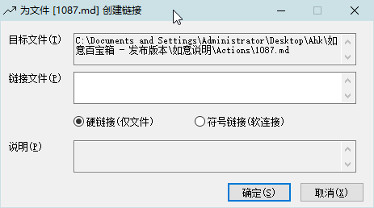

<link rel="stylesheet" href="../Actions/css/atom-one-light.min.css">

[返回主页](../index.md)

#  创建软硬链接

**动作编号**: 1045  
**动作名称**: 创建软硬链接  
**动作作用的对象**: 选中文件  
**动作热键**: 无  
**动作鼠标手势**: 无  
**动作说明**: 为选中的文件创建软硬链接  
**动作截图**:   
    
**动作内容**: run|"%B_Autohotkey%" "%A_ScriptDir%\外部脚本\文件处理\文件创建软硬链接.ahk" "%candysel%"  
将选中文件路径作为参数, 执行外部脚本文件 "文件创建软硬链接.ahk", ATA 内置动作  

**代码或详细解释**:  
选中文件后, 执行动作, 在弹出的窗口中输入链接的路径, 为选中的文件创建软硬链接.  