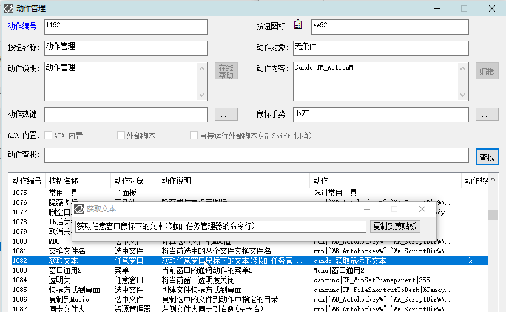

[返回主页](../index.md)

#  获取文本

**动作编号**: 1082  
**动作名称**: 获取文本  
**动作作用的对象**: 任意窗口  
**动作热键**: !k  
**动作鼠标手势**: 无  
**动作说明**: 获取任意窗口鼠标下的文本(例如 任务管理器的命令行)  
**动作截图**:  
    
**动作内容**: cando|获取鼠标下文本  
执行如意内置标签 "获取鼠标下文本".   

**代码或详细解释**:  
鼠标移到要获取文本的位置, 按下快捷键执行动作, 使用 UIA 获取标准窗口鼠标下的文本.  