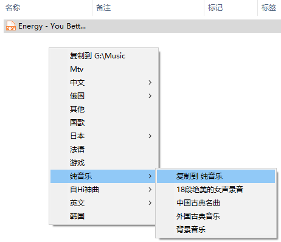

<link rel="stylesheet" href="../Actions/css/atom-one-light.min.css">

[返回主页](../index.md)

#  如意百宝箱-Ahk 动作介绍

**动作编号**: 1086  
**动作名称**: 复制到Music  
**动作作用的对象**: 选中文件  
**动作热键**: 无  
**动作鼠标手势**: 无  
**动作说明**: 复制选中的文件到动作中指定的目录  
**动作截图**:  
    
**动作内容**: run|"%B_Autohotkey%" "%A_ScriptDir%\外部脚本\文件处理\复制文件到指定文件夹.ahk" "%CandySel%" "G:\Music"  
将选中文件的路径作为参数, 执行外部脚本文件 "复制文件到指定文件夹.ahk", ATA 内置该动作  

**代码或详细解释**:    
选中文件, 执行动作, 显示一个指定文件夹(如 G:\Music) 的菜单, 选择菜单项将选中文件复制到相应文件夹.   