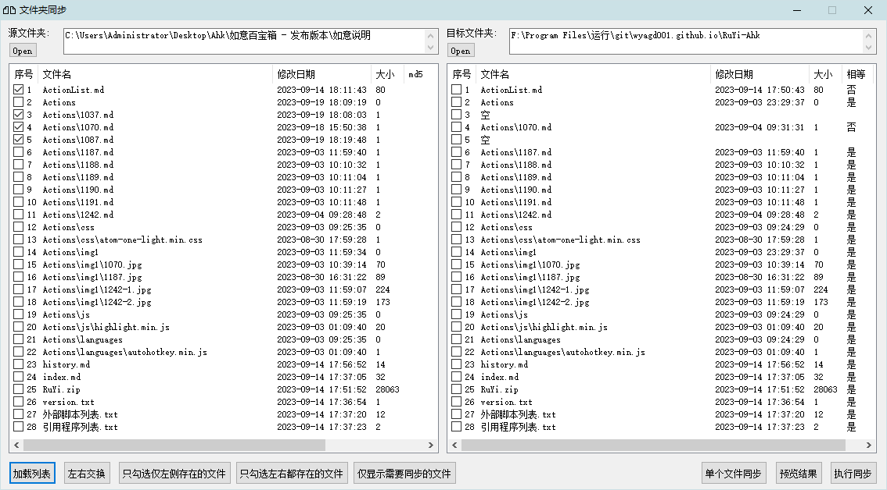
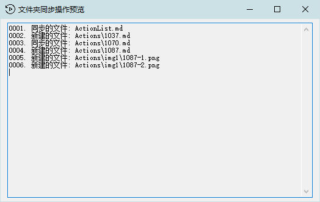

[返回主页](../index.md)

#  同步文件夹

**动作编号**: 1087, 1088, 1089  
**动作名称**: 同步文件夹  
**动作作用的对象**: 资源管理器窗口  
**动作热键**: 无  
**动作鼠标手势**: 无  
**动作说明**: 左侧文件夹同步到右侧的文件夹(左→右)  
**动作截图**:  
  
    
    
**动作内容**: run|"%B_Autohotkey%" "%A_ScriptDir%\外部脚本\窗口处理\打开的文件夹同步.ahk" "%Windy_CurWin_FolderPath%"  
动作 1087, 将当前资源管理器窗口所打开的文件夹路径作为参数, 执行外部脚本文件 "打开的文件夹同步.ahk", 参数为文件夹同步工具的左侧文件夹, ATA 内置了该动作.   

run|"%B_Autohotkey%" "%A_ScriptDir%\外部脚本\窗口处理\打开的文件夹同步.ahk" "C:\Users\Administrator\Desktop\Ahk\如意百宝箱" "F:\Program Files\运行\git\RuYi-Ahk"  
动作 1089, 可以一次指定两个文件夹, 分别作为左右文件夹.  

canfunc|ExecSend|%Windy_CurWin_FolderPath%|文件夹同步 ahk_class AutoHotkeyGUI  
动作 1088, 在第二个打开文件夹将路径发送到文件夹同步工具, 作为右侧文件夹, 如意内置的函数  

**代码或详细解释**:  

"打开的文件夹同步.ahk" 脚本的作用是将左侧的文件夹中的文件同步到右侧的文件夹.  
同步: 以相对文件路径来将左右文件夹中的一组同步文件进行同步  
相对文件路径左右两边都存在  
1. 左边与右边都存在的文件, 如果判断不同, 则复制左边的文件覆盖右边的文件.  
相对文件路径只有一边存在  
2. 左边文件夹中存在的文件, 右边文件夹不存在, 则复制文件到右边.  
3. 右边文件夹中存在的文件, 左边文件夹中不存在, 则删除.   

动作 1087 将当前资源管理器窗口所打开的文件夹路径作为参数 1, 传递启动脚本, 路径参数作为文件夹同步工具的左侧文件夹(源文件夹), 配合动作 1088 将另一个文件夹路径作为参数 2, 传递给脚本, 设置为同步文件夹右侧文件夹(目标文件夹).  

配置文件 ".忽略列表.ini" 中的 [判断依据] 段下的 "判断类型" 可以定义判断文件是否相同的方法, 值为 "文件md5" 和 "最近修改时间". 没有配置文件或没有指定时默认为 "最近修改时间". 配置文件中的其他内容为指定同步时忽略的文件或文件夹. 右边的文件夹中配置文件优先, 以满足一对多, 且忽略条件不同的情况.  
**文件md5**: 每一组文件名相同的文件, 首先比较大小, 如果大小不相等, 则判定文件不同, 需要同步. 如果大小相同, 则比较 Md5 值, md5 值不一致, 判定文件不同, 需要同步. 判断文件是否相同, 结果准确, 但是耗时长.  
**最近修改时间**: 每一组文件名相同的文件, 首先比较大小, 如果大小不相等, 则判定文件不同, 需要同步. 如果大小相同, 则比较文件修改时间是否相同, 修改时间相同则判断文件相同, 不进行同步. 反之, 则需要同步.  

