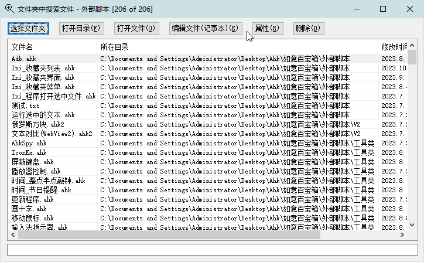

<link rel="stylesheet" href="../Actions/css/atom-one-light.min.css">

[返回主页](../index.md)

#  搜索文件夹

**动作编号**: 1093  
**动作名称**: 搜索文件夹  
**动作作用的对象**: 资源管理器  
**动作热键**: 无  
**动作鼠标手势**: 无  
**动作说明**: 使用文件名搜索资源管理器窗口当前文件夹中的文件    
**动作截图**:  
    
**动作内容**: run|"%B_Autohotkey%" "%A_ScriptDir%\外部脚本\文件处理\文件夹处理\文件夹中搜索文件.ahk" "%Windy_CurWin_FolderPath%"  
以当前打开的文件夹路径为参数, 执行外部脚本文件 "文件夹中搜索文件.ahk", 独立的脚本动作  

**代码或详细解释**:  
在资源管理器窗口, 执行动作, 弹出一个当前文件夹中所有文件的列表窗口, 输入文件名进行搜索.  