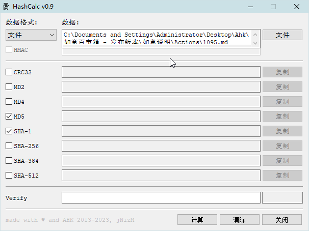

<link rel="stylesheet" href="../actions/css/atom-one-light.min.css">

[返回主页](../index.md)

#  Hash

**动作编号**: 1095  
**动作名称**: Hash  
**动作作用的对象**: 选中文件  
**动作热键**: 无  
**动作鼠标手势**: 无  
**动作说明**: 计算选中文件的 MD5 值  
**动作截图**:  
    
**动作内容**: run|"%B_Autohotkey%" "%A_ScriptDir%\外部脚本\文件处理\HashCalc.ahk" "%CandySel%"  
将选中文件路径(单选) 作为参数, 执行外部脚本文件 "HashCalc.ahk", ATA 内置动作  

**代码或详细解释**:  
选中文件后, 执行动作, 脚本将显示一个可以计算选中文件 CRC32, MD5, SHA 等值的窗口.  