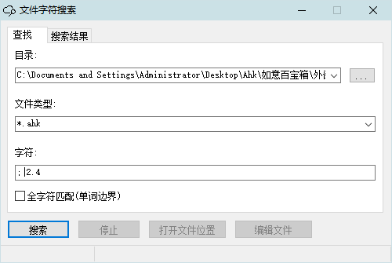
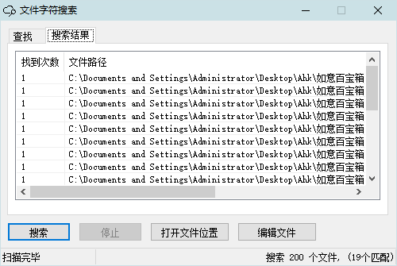

<link rel="stylesheet" href="../Actions/css/atom-one-light.min.css">

[返回主页](../index.md)

#  如意百宝箱-Ahk 动作介绍

**动作编号**: 1096  
**动作名称**: 搜索文件内容  
**动作作用的对象**: 资源管理器  
**动作热键**: ^+f(Ctrl+Shift+F)  
**动作鼠标手势**: 无  
**动作说明**: 搜索资源管理器窗口当前文件夹中文本文件中的内容  
**动作截图**:  
    
    
**动作内容**: run|"%B_Autohotkey%" "%A_ScriptDir%\外部脚本\文件处理\文件夹处理\文本文件中查找字符.ahk" "%Windy_CurWin_FolderPath%"  
在资源管理器窗口, 按下快捷键将当前打开文件夹路径作为参数, 执行外部脚本文件 "\文本文件中查找字符.ahk", ATA 内置动作  
**代码及详细解释**:  
搜索当前打开文件夹中指定类型的文本文件是否包含搜索的关键词, 并将结果显示在列表中.  
