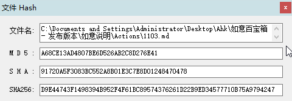

<link rel="stylesheet" href="../Actions/css/atom-one-light.min.css">

[返回主页](../index.md)

#  Hash2

**动作编号**: 1103  
**动作名称**: Hash2  
**动作作用的对象**: 选中文件  
**动作热键**: 无  
**动作鼠标手势**: 无  
**动作说明**: 计算选中文件的 Hash 值  
**动作截图**:  
    
**动作内容**: run|"%B_Autohotkey%" "%A_ScriptDir%\外部脚本\文件处理\Hash_File.ahk" "%CandySel%"  
将选中文件路径(单选) 作为参数, 执行外部脚本文件 "Hash_File.ahk", ATA 内置动作  

**代码或详细解释**:  
选中文件后, 执行动作, 脚本将显示选中文件 MD5, SHA, SHA256 值的窗口.  