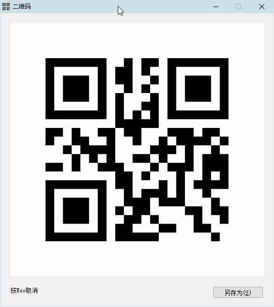

[返回主页](../index.md)

#  二维码

**动作编号**: 1173  
**动作名称**: 二维码  
**动作作用的对象**: 选中文本  
**动作热键**: 无  
**动作鼠标手势**: 无  
**动作说明**: 选中文字生成二维码  
**动作截图**:  
    
**动作内容**: run|"%B_Autohotkey%" "%A_ScriptDir%\外部脚本\文本处理\生成二维码.ahk" "%CandySel%"  
以选中文本作为参数, 执行外部脚本文件 "生成二维码.ahk", ATA 内置该动作.

**代码或详细解释**:  
选中文本, 运行动作, 将选中文本显示为二维码.  
相关动作 [5038 共享WiFi](5038.md)  