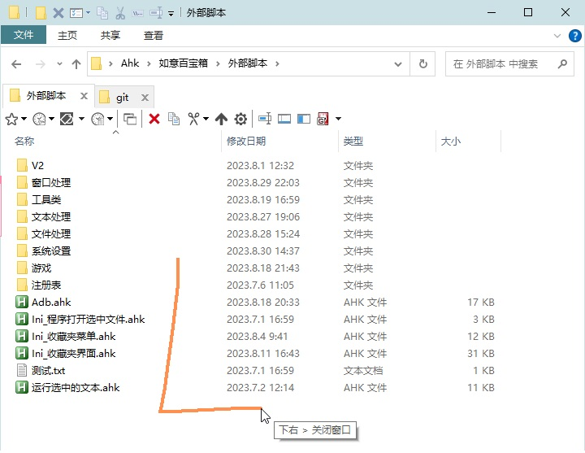

<link rel="stylesheet" href="../Actions/css/atom-one-light.min.css">
<script src="../Actions/js/highlight.min.js"></script>
<script>hljs.highlightAll();</script>

[返回主页](../index.md)

# [](#header-2) 如意百宝箱-Ahk 动作介绍

**动作编号**: 1187  
**动作名称**: 关闭窗口  
**动作作用的对象**: 任意窗口  
**动作热键**: 无  
**动作鼠标手势**: 下右(↓→)  
**动作说明**: 关闭窗口(chrome 等特定窗口为关闭标签页)  
**动作截图**:  
    
**动作内容**: Cando|关闭窗口
执行如意的内置的标签 "关闭窗口", 为如意内置动作  

**代码及详细解释**:  
利用鼠标手势 <下右>, 将鼠标下的窗口关闭, 特定窗口(如浏览器) 为发送 "^W" 来关闭标签页. 使用时需要手动关闭浏览器的对应手势(内置的或安装的扩展), 避免发生冲突. 下面的代码为内置的标签 "关闭窗口" 的代码.  

```Autohotkey
; 1187
关闭窗口:
;Tooltip % Windy_CurWin_Class
if (Windy_CurWin_Class = "Chrome_WidgetWin_1") or (Windy_CurWin_Class = "360se6_Frame") or (Windy_CurWin_Class = "SciTEWindow") or (Windy_CurWin_Class = "CabinetWClass" && (QTTabBar or buildNumber>22000)) or (Windy_CurWin_Class = "Photoshop") or (Windy_CurWin_Class = "notepad" && buildNumber>22000)
{
	WinActivate, Ahk_ID %Windy_CurWin_id%
	sleep 20
	Send ^w
}
else if (Windy_CurWin_Class = "Progman") or (Windy_CurWin_Class = "WorkerW") or (Windy_CurWin_Class = "Shell_TrayWnd")
{
	WinClose ahk_class Progman
}
else
	PostMessage, 0x112, 0xF060,,, ahk_id %Windy_CurWin_id%
return
```