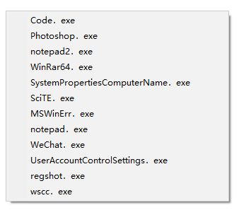

<link rel="stylesheet" href="../Actions/css/atom-one-light.min.css">

[返回主页](../index.md)

#  Ini_Opw

**动作编号**: 1213  
**动作名称**: Ini_Opw  
**动作作用的对象**: 无条件  
**动作热键**: 无  
**动作鼠标手势**: 无  
**动作说明**: Ini 文件显示为程序菜单, 使用菜单中的程序打开选中的文件  
**动作截图**:  
    
**动作内容**: run|"%B_Autohotkey%" "%A_ScriptDir%\外部脚本\Ini_程序打开选中文件.ahk" "%CandySel%"  
将选中文件路径作为参数, 执行外部脚本文件 "Ini_程序打开选中文件.ahk", ATA 内置该动作  

**代码或详细解释**:  
Ini_Fav 的配置文件位于: 配置文件\外部脚本\ini菜单.ini  
将 Ini 收藏夹的配置中的 "程序" 段显示为一个菜单, 点击菜单条目使用相应的程序来打开选中的文件.  