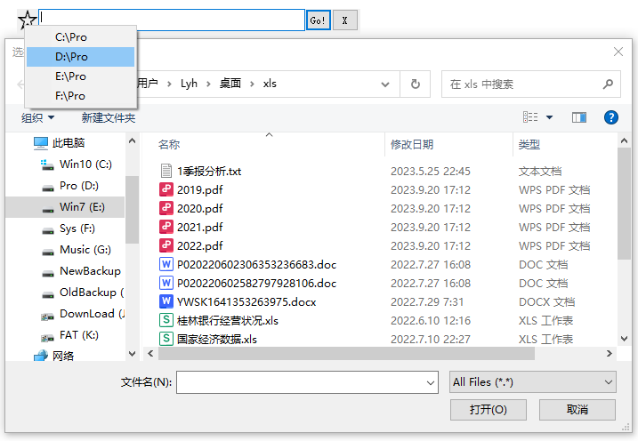

<link rel="stylesheet" href="../Actions/css/atom-one-light.min.css">

[返回主页](../index.md)

#  对话框收藏夹

**动作编号**: 1239  
**动作名称**: 对话框收藏夹  
**动作作用的对象**: 对话框  
**动作热键**: 无  
**动作鼠标手势**: 无  
**动作说明**: 对话框跳转到ini文件中预设的文件夹  
**动作截图**:  
    
    
**动作内容**: run|"%B_Autohotkey%" "%A_ScriptDir%\外部脚本\窗口处理\对话框_收藏夹.ahk" "%Windy_CurWin_id%"  
以当前窗口句柄作为参数, 执行外部脚本文件 "对话框_收藏夹.ahk", ATA 内置动作  

**代码或详细解释**:  
在文件打开或保存对话框, 执行动作, 弹出一个带有收藏夹按钮和编辑框的窗口, 选择按钮弹出菜单项目或输入路径使对话框跳转到指定路径.  
相关动作 [1042 当前窗口打开](1042.md), [1226 打开目录](1226.md)