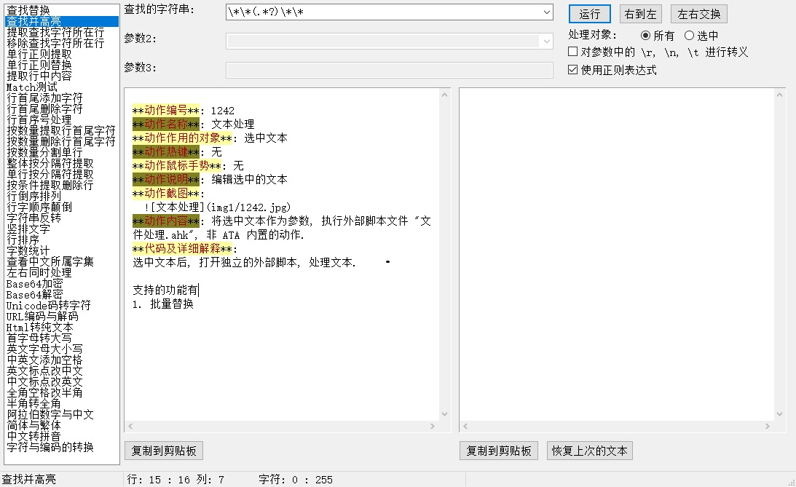

[返回主页](../index.md)

#  文本处理

**动作编号**: 1242  
**动作名称**: 文本处理  
**动作作用的对象**: 选中文本  
**动作热键**: 无  
**动作鼠标手势**: 无  
**动作说明**: 编辑选中的文本  
**动作截图**: 无  
**动作内容**: run|"%B_Autohotkey%" "%A_ScriptDir%\外部脚本\文本处理\文本处理.ahk" "%CandySel%"  
以选中文本作为参数, 执行外部脚本文件 "文本处理.ahk", 独立的脚本动作.  

**代码或详细解释**:  
选中文本后, 打开独立的外部脚本界面窗口, 利用该窗口来批量快速的处理文本. 左边为功能列表, 右边为上部为小功能选择或条件指定, 点击 "运行" 按钮, 在下面右边得到转换好的文本.  

支持的功能有:  
1. 查找替换: 批量替换所有(支持正则表达式)  
    
2. 高亮所有查找的文本(支持正则表达式, 来自 Ahk 正则终结者)  
    
3. 提取查找字符所在行: 快速提取查找字符串所在行  
4. 移除查找字符所在行: 快速删除查找字符串所在行  
5. 单行正则提取: 按给定正则表达式对每行文本提取文本  
6. 单行正则替换: 按给定正则表达式对每行文本进行替换操作  
7. 提取行中内容: 按给定的条件提取, 主要为按 csv 提取列和按 tab 提取列  
8. Match测试: Ahk 的正则 Match 测试(原义的双引号与在脚本中不同, 不需要两个连写)  
9. 行首尾添加字符  
10. 行首尾删除字符  
11. 行首序号处理  
12. 按数量提取行首尾字符  
13. 按数量删除行首尾字符  
14. 按数量分割单行  
15. 整体按分隔符提取  
16. 单行按分隔符提取  
17. 按条件提取删除行  
18. 行倒序排列  
19. 行字顺序颠倒  
20. 字符串反转  
21. 竖排文字  
22. 行排序  
23. 字数统计: 统计文本所包含的字符总数、行数、汉字数、英文数、符号数等  
24. 查看中文所属字集  
25. 左右同时处理  
26. Base64加密  
27. Base64解密  
28. Unicode码转字符  
29. URL编码与解码  
30. Html转纯文本  
31. 首字母转大写  
32. 英文字母大小写  
33. 中英文添加空格  
34. 英文标点改中文  
35. 中文标点改英文  
36. 全角空格改半角  
37. 半角转全角  
38. 阿拉伯数字与中文  
39. 简体与繁体  
40. 中文转拼音  
41. 字符与编码的转换  
  

