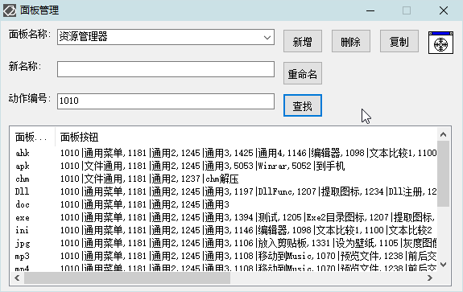

<link rel="stylesheet" href="../Actions/css/atom-one-light.min.css">

[返回主页](../index.md)

#  面板管理

**动作编号**: 1263  
**动作名称**: 面板管理  
**动作作用的对象**: 无条件  
**动作热键**: 无  
**动作鼠标手势**: 无  
**动作说明**: 管理如意中的面板  
**动作截图**:  
    
    
**动作内容**: Cando|TM_BoardM 
执行如意的内置的标签 "TM_BoardM", 如意内置动作  

**代码及详细解释**:  
显示如意面板管理界面.  .
   - 面板名称输入新的名称, 然后新增  
   - 面板名称选择一个已有的面板名称, 然后删除  
   - 面板名称选择一个已有的面板名称, 然后复制  
   - 面板名称选择一个已有的面板名称, 在新名称输入, 重命名  
   - 动作编号查找动作在哪个面板  
   - 右键面板列表中的项目, 打开面板, 编辑面板上的按钮  