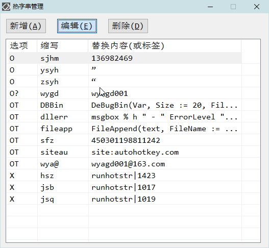

<link rel="stylesheet" href="../Actions/css/atom-one-light.min.css">

[返回主页](../index.md)

#  如意百宝箱-Ahk 动作介绍

**动作编号**: 1264  
**动作名称**: 热字串管理  
**动作作用的对象**: 无条件  
**动作热键**: 无  
**动作鼠标手势**: 无  
**动作说明**: 管理如意的热字串  
**动作截图**:  
    
    
**动作内容**: Cando|hotstrM  
为如意内置的动作, 执行如意的内置的标签 "hotstrM"  

**代码或详细解释**:  
显示一个如意热字串的列表, 可以在该设置界面管理如意的热字串.  
要热字串执行如意动作, 请勾选执行模式复选框, 替换内容为 "runhotstr|动作编号"", 如 "runhotstr|1423"  