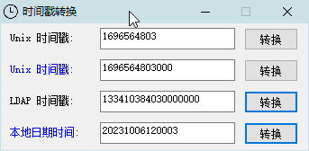

<link rel="stylesheet" href="../actions/css/atom-one-light.min.css">

[返回主页](../index.md)

#  时间戳

**动作编号**: 1296  
**动作名称**: 时间戳  
**动作作用的对象**: 选中文本  
**动作热键**: 无  
**动作鼠标手势**: 无  
**动作说明**: 选中的文本进行时间戳和日期时间的互相转换  
**动作截图**:  
    
**动作内容**: run|"%B_Autohotkey%" "%A_ScriptDir%\外部脚本\文本处理\数字_时间戳转换.ahk" "%CandySel%"  
以选中文本作为参数, 执行外部脚本文件 "数字_时间戳转换.ahk", ATA 内置动作  

**代码或详细解释**:  
时间戳和日期时间的互相转换.  