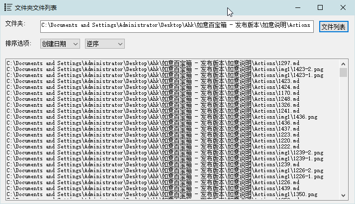

[返回主页](../index.md)

#  文件列表

**动作编号**: 1297  
**动作名称**: 文件列表  
**动作作用的对象**: 选中文件夹  
**动作热键**: 无  
**动作鼠标手势**: 无  
**动作说明**: 显示选中文件夹中的所有文件的路径列表(整合版)  
**动作截图**:  
    
**动作内容**: run|"%B_Autohotkey%" "%A_ScriptDir%\外部脚本\文件处理\文件夹处理\文件夹_文件列表(整合版).ahk" "%CandySel%"  
以选中文件夹路径作为参数, 执行外部脚本文件 "文件夹_文件列表.ahk", ATA 内置该动作  

**代码或详细解释**:  
选中文件夹, 执行动作, 弹出一个能显示选中文件夹中所有文件列表的窗口. 文件列表能按条件排序.  

**相关动作**:  
[1298 文件列表默认顺序](1298.md), [1299 文件列表创建时间排序](1299.md), [1300 文件列表修改时间排序](1300.md), [1301 文件列表文件大小排序](1301.md).  

**更新历史**:  
1. 1.9 中首次添加该动作
2. 2.5 中新增了更多的选项(显示相对路径, 显示子文件夹, 不显示隐藏只读系统文件), 可显示的文件最大数量由 500 改为 3000.  