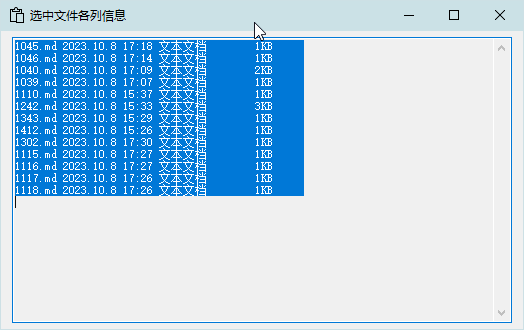

<link rel="stylesheet" href="../actions/css/atom-one-light.min.css">

[返回主页](../index.md)

#  复制信息

**动作编号**: 1302  
**动作名称**: 复制信息  
**动作作用的对象**: 任意窗口  
**动作热键**: 无  
**动作鼠标手势**: 无  
**动作说明**: 将资源管理器选中文件各列显示的信息复制到剪贴板  
**动作截图**:  
    
**动作内容**: run|"%B_Autohotkey%" "%A_ScriptDir%\外部脚本\窗口处理\复制资源管理器各列的信息.ahk" "%CandySel%"  
以选中文件路径作为参数, 执行外部脚本文件 "复制资源管理器各列的信息.ahk", ATA 内置动作  

**代码或详细解释**:  
在资源管理器窗口选中文件, 执行脚本, 复制资源管理器中当前各列显示的信息.  