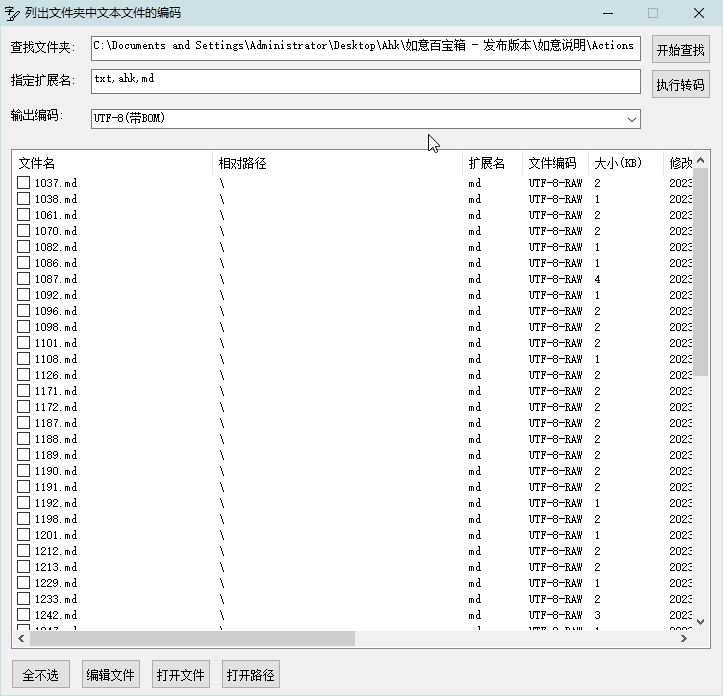

[返回主页](../index.md)

#  管理编码

**动作编号**: 1316  
**动作名称**: 管理编码  
**动作作用的对象**: 选中文件夹  
**动作热键**: 无  
**动作鼠标手势**: 无  
**动作说明**: 列出选中文件夹中文本文件编码, 批量转码  
**动作截图**:  
    
**动作内容**: run|"%B_Autohotkey%" "%A_ScriptDir%\外部脚本\文件处理\文件夹处理\管理文本文件编码.ahk" "%CandySel%"  
将选中文件夹路径作为参数, 执行外部脚本文件 "管理文本文件编码.ahk", 独立脚本动作.   

**代码或详细解释**:  

对文件夹中文本文件进行批量转码.  