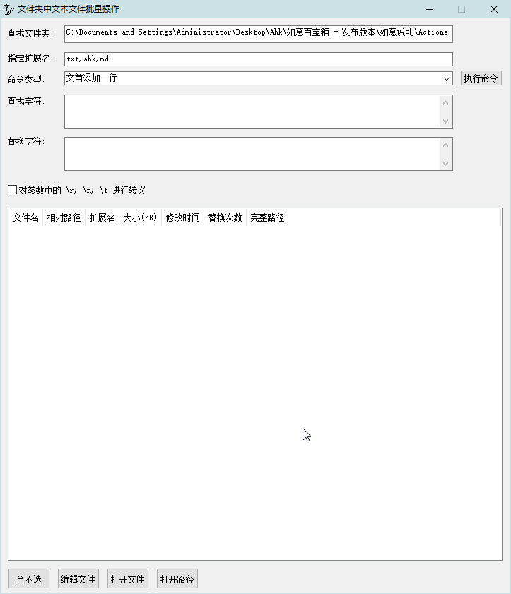

[返回主页](../index.md)

#  文本批量

**动作编号**: 1333  
**动作名称**: 文本批量  
**动作作用的对象**: 选中文件夹  
**动作热键**: 无  
**动作鼠标手势**: 无  
**动作说明**: 对文件夹中文本文件进行批量操作(替换, 开头(/结尾)新增(/删除)一行)  
**动作截图**:  
    
**动作内容**: run|"%B_Autohotkey%" "%A_ScriptDir%\外部脚本\文件处理\文件夹处理\文本文件批量操作.ahk" "%CandySel%"  
将选中文件夹路径作为参数, 执行外部脚本文件 "文本文件批量操作.ahk", 独立脚本动作.   

**代码或详细解释**:  

对文件夹中文本文件进行批量操作, 例如批量文本替换, 文首文末添加一行, 文首文末删除一行.  