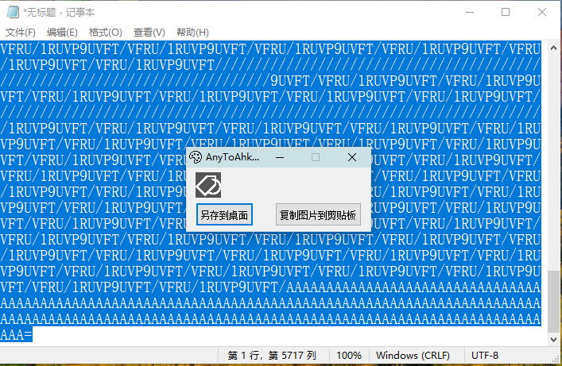

[返回主页](../index.md)

#  Base64解密

**动作编号**: 1338  
**动作名称**: Base64解  
**动作作用的对象**: 选中文本  
**动作热键**: 无  
**动作鼠标手势**: 无  
**动作说明**: 将选中的Base64解密, 显示加密前的图片  
**动作截图**:  
    
**动作内容**: run|"%B_Autohotkey%" "%A_ScriptDir%\外部脚本\文本处理\Base64解密为图片.ahk" "%CandySel%"  
以选中文本作为参数, 执行外部脚本文件 "Base64解密为图片.ahk", ATA 内置该动作  

**代码或详细解释**:  
选中Base64码, 执行动作, 将 Base64 码解密, 得到加密前的图片.  

**相关动作**:  
[1336 Base64解密](1336.md), [1337 Base64加密](1337.md), [1339 Base64加密](1339.md), [1340 B64转HTML](1340.md), [1341 B64转图片](1341.md).  