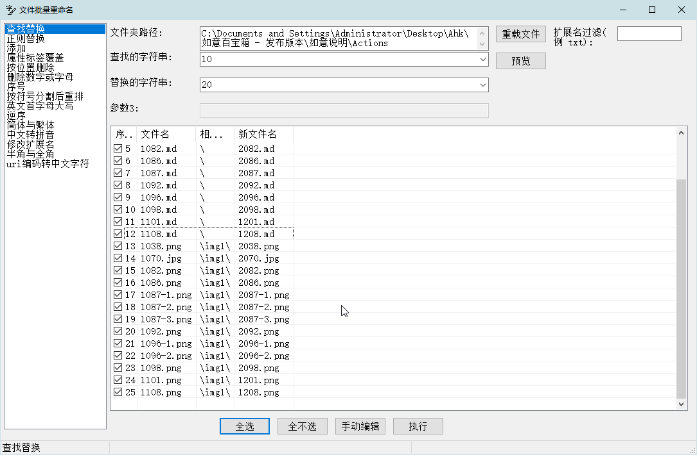

[返回主页](../index.md)

#  如意百宝箱-Ahk 动作介绍

**动作编号**: 1352  
**动作名称**: 批量重命名  
**动作作用的对象**: 选中文件夹  
**动作热键**: 无  
**动作鼠标手势**: 无  
**动作说明**: 对文件夹中的文件进行批量重命名操作  
**动作截图**:  
    
**动作内容**: run|"%B_Autohotkey%" "%A_ScriptDir%\外部脚本\文件处理\文件夹处理\批量重命名.ahk" "%CandySel%"  
将选中文件夹路径作为参数, 执行外部脚本文件 "批量重命名.ahk", 独立脚本动作.   

**代码或详细解释**:  

对文件夹中文本文件进行批量重命名操作.  
   - 文本替换(支持文件标签变量, 如 \\创建日期\\)  
   - 正则替换  
   - 添加字符(文件名前, 后, 指定位置)(支持文件标签变量, 如 \\创建日期\\)  
   - 以文件属性标签模板覆盖原文件名  
   - 按位置删除字符  
   - 删除数字, 字母  
   - 序号管理(添加序号, 删除序号)  
   - 按符号分割后重排  
   - 英文首字母大写  
   - 逆序  
   - 简体与繁体  
   - 中文转拼音  
   - 修改扩展名  
   - 半角与全角  
   - URI编码转中文字符  