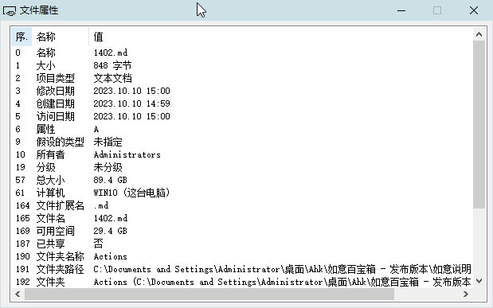

[返回主页](../index.md)

#  查看属性

**动作编号**: 1402  
**动作名称**: 查看属性  
**动作作用的对象**: 选中文件  
**动作热键**: 无  
**动作鼠标手势**: 无  
**动作说明**: 获取选中文件的资源管理器详细信息列中能列出的属性  
**动作截图**:  
    
**动作内容**: run|"%B_Autohotkey%" "%A_ScriptDir%\外部脚本\文件处理\文件_额外的属性(GetDetailsOf).ahk" "%CandySel%"  
将选中文件路径作为参数, 执行外部脚本文件 "文件_额外的属性(GetDetailsOf).ahk", ATA 内置该动作  

**代码或详细解释**:  
选中文件后, 执行动作, 弹出一个显示文件属性的窗口. 
