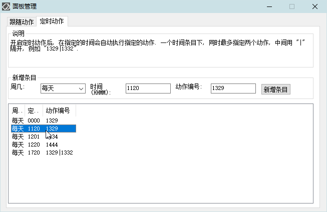

<link rel="stylesheet" href="../Actions/css/atom-one-light.min.css">

[返回主页](../index.md)

#  如意百宝箱-Ahk 动作介绍

**动作编号**: 1414  
**动作名称**: 定时管理  
**动作作用的对象**: 无条件  
**动作热键**: 无  
**动作鼠标手势**: 无  
**动作说明**: 跟随动作和定时动作管理界面  
**动作截图**:  
    
    
**动作内容**: Cando|TimingActionM  
为如意内置的动作, 执行如意的内置的标签 "TimingActionM"  

**代码或详细解释**:  
显示一个设置窗口, 可以在该设置界面管理如意的跟随动作和定时动作.  
