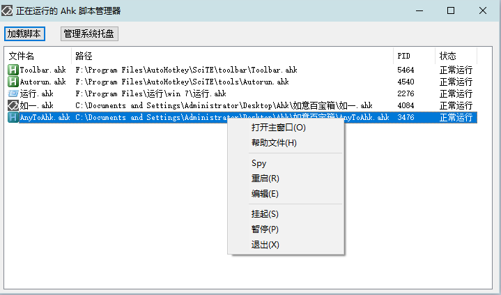
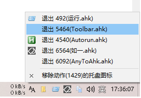

<link rel="stylesheet" href="../Actions/css/atom-one-light.min.css">

[返回主页](../index.md)

#  如意百宝箱-Ahk 动作介绍

**动作编号**: 1429  
**动作名称**: 脚本管理器  
**动作作用的对象**: 无条件  
**动作热键**: 无  
**动作鼠标手势**: 无  
**动作说明**: Ahk 脚本管理器  
**动作截图**:  
    
    
**动作内容**: Cando|ScriptManager  
如意内置动作, 执行内置标签 "ScriptManager"  
**代码或详细解释**:    
执行动作, 显示一个当前正在运行的 Ahk 脚本列表, 右键管理.  
如果将动作放入托盘, 右键托盘图标, 会显示一个当前正在运行的 Ahk 脚本的菜单, 点击菜单项, 退出相应脚本.