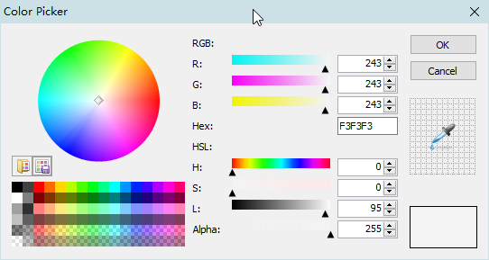

<link rel="stylesheet" href="../actions/css/atom-one-light.min.css">

[返回主页](../index.md)

#  获取颜色

**动作编号**: 1436  
**动作名称**: 获取颜色  
**动作作用的对象**: 选中文本或无条件  
**动作热键**: 无  
**动作鼠标手势**: 无  
**动作说明**: 查看选中数字对应的颜色, 并带有取色功能  
**动作截图**:  
     
**动作内容**: run|"%B_Autohotkey%" "%A_ScriptDir%\外部脚本\文本处理\取色小程序.ahk" "%CandySel%"  
将选中数字作为参数, 执行外部脚本文件 "取色小程序.ahk", ATA 内置动作  

**代码或详细解释**:  
选中数字后, 执行动作, 执行 "引用程序\x32\ColorPicker.exe", 显示一个对应颜色的 Gui 窗口. 可以取色.  