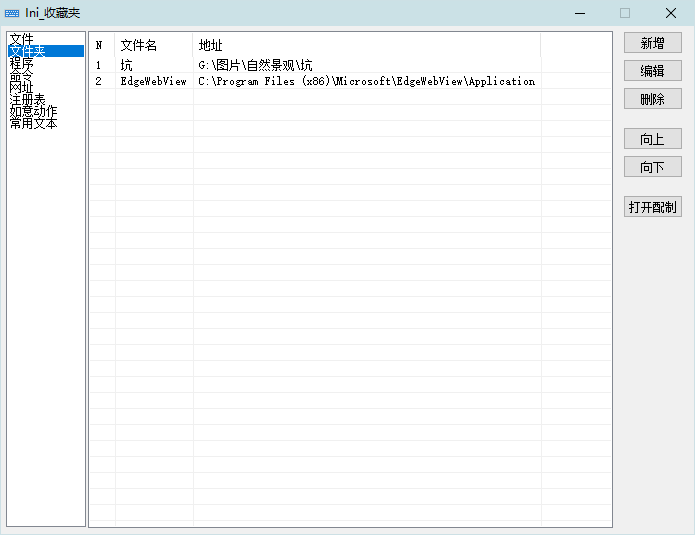

<link rel="stylesheet" href="../Actions/css/atom-one-light.min.css">

[返回主页](../index.md)

#  如意百宝箱-Ahk 动作介绍

**动作编号**: 1516  
**动作名称**: Ini_Fav  
**动作作用的对象**: 无条件  
**动作热键**: 无  
**动作鼠标手势**: 无  
**动作说明**: Ini 文件显示为列表面板(作为收藏夹使用)  
**动作截图**:  
    
**动作内容**: run|"%B_Autohotkey%" "%A_ScriptDir%\外部脚本\Ini_收藏夹列表.ahk"  
执行外部脚本文件 "Ini_收藏夹列表.ahk"  
**代码或详细解释**:  
Ini_Fav 的配置文件位于: 配置文件\外部脚本\ini菜单.ini  
将 Ini 收藏夹的配置显示为一个 Gui 界面, 其中每个段作为子项, 点击子项中的列表条目打开相应条目. 如打开文件, 文件夹, 网址, 命令...