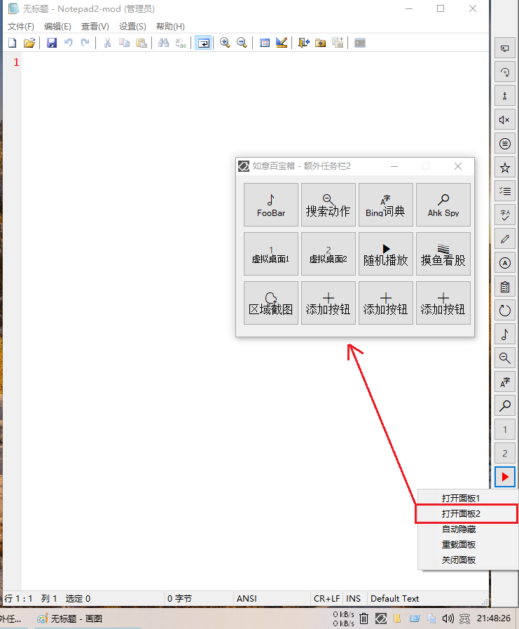

<link rel="stylesheet" href="../Actions/css/atom-one-light.min.css">

[返回主页](../index.md)

#  额外任务栏

**动作编号**: 1523  
**动作名称**: 额外任务栏  
**动作作用的对象**: 无条件  
**动作热键**: 无  
**动作鼠标手势**: 无  
**动作说明**: 额外任务栏临时关闭后, 再次打开额外任务栏  
**动作截图**:  
    
**动作内容**: Cando|CreateAppBar  
执行如意的内置的标签 "CreateAppBar", 如意内置动作  

**代码及详细解释**:  
额外任务栏可以通过右键菜单临时关闭, 在不重启如意的情况下, 可以通过执行本动作来重新打开额外任务栏窗口.  

如果要永久关闭额外任务栏, 请在 "如意设置→功能开关二" 中取消 "额外任务栏" 的勾选.  
或手动修改配置文件 "如一.ini→配置".  
额外任务栏=1            ; 值为 0 关闭, 1 为 打开  
额外任务栏_Pos=右       ; 额外任务栏窗口的位置, 值为 上, 下, 左, 右  
额外任务栏_AutoHide=0   ; 是否开启自动隐藏功能, 开启后自动隐藏且不占据桌面的区域   

**相关动作**:  
[1525 按钮颜色](1525.md)

**更新历史**:  
1. 2.4 中添加该动作