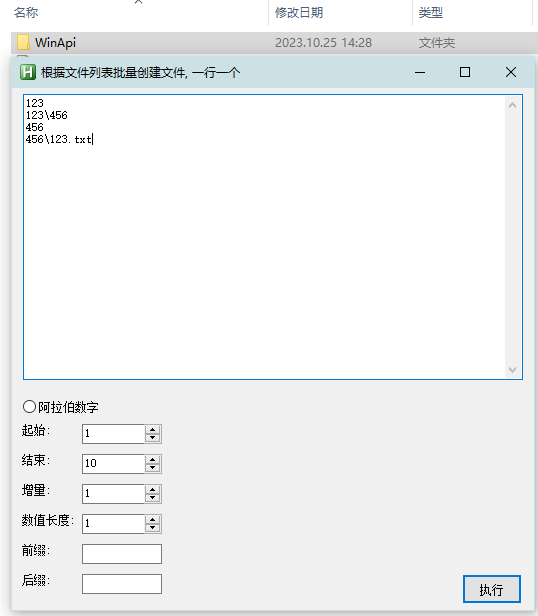

<link rel="stylesheet" href="../Actions/css/atom-one-light.min.css">

[返回主页](../index.md)

#  批量文件

**动作编号**: 1543  
**动作名称**: 批量文件  
**动作作用的对象**: 选中文件夹  
**动作热键**: 无  
**动作鼠标手势**: 无  
**动作说明**: 在选中文件夹下批量创建文件(文件夹), 一行一个  
**动作截图**:   
    
**动作内容**: run|"%B_Autohotkey%" "%A_ScriptDir%\外部脚本\文件处理\文件夹处理\文件夹_批量创建文件.ahk" "%CandySel%" "X"  
以选中文件夹路径为参数, 执行外部脚本文件 "文件夹_批量创建文件.ahk".   

**代码或详细解释**:  
在选中文件夹中, 按弹出窗口中文本框中的路径批量新建文件(夹).  
可以勾选编辑框下的阿拉伯数字选项, 自动生成数字序号的批量文件夹.  

**更新历史**:  
1. 2.5 中首次添加该动作