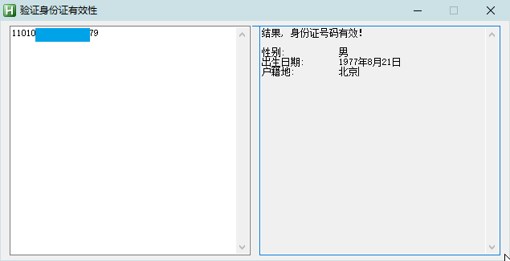

<link rel="stylesheet" href="../Actions/css/atom-one-light.min.css">

[返回主页](../index.md)

#  验证身份证

**动作编号**: 1544  
**动作名称**: 验证身份证  
**动作作用的对象**: 选中文本  
**动作热键**: 无  
**动作鼠标手势**: 无  
**动作说明**: 选中身份证号码, 验证是否有效  
**动作截图**:   
    
**动作内容**: run|"%B_Autohotkey%" "%A_ScriptDir%\外部脚本\文本处理\验证身份证号码.ahk" "%CandySel%"  
以选中文本为参数, 执行外部脚本文件 "验证身份证号码.ahk".   

**代码或详细解释**:  
选中身份证号码, 验证是否有效, 并显示相关信息.  

**更新历史**:  
1. 2.5 中首次添加该动作