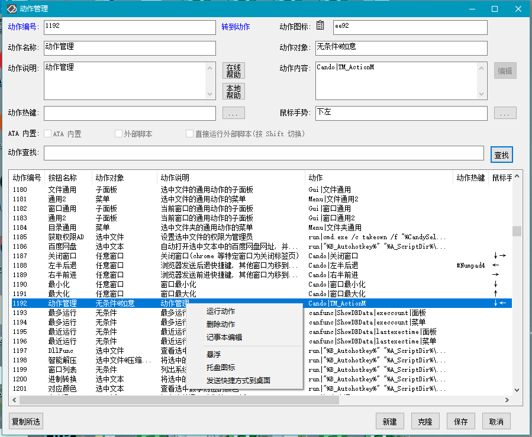

<link rel="stylesheet" href="../actions/css/atom-one-light.min.css">

[返回主页](../index.md)

#  动作管理

**动作编号**: 1192  
**动作名称**: 动作管理  
**动作作用的对象**: 无条件  
**动作热键**: 无  
**动作鼠标手势**: 下左(↓←)  
**动作说明**: 如意的动作管理界面  
**动作截图**:  
    
**动作内容**: Cando|TM_ActionM  
执行如意的内置的标签 "TM_ActionM", 为如意内置动作  

**代码或详细解释**:  
显示一个如意所有动作的列表, 可以在该界面管理动作.  

动作编号: 相当于文件名, 新的动作需要指定一个新的动作编号, 例如 5041, 然后填充其他项目保存即可. 新动作也可由原有动作修改后, 指定新的动作编号后保存为新动作.  

动作图标: 动作在面板按钮和菜单中显示的图标  
1[\[2.1+\]](../history.md#2.1): 可自定义子面板中按钮的颜色, 例 e188@DD3c4F, e188 为字符的编码, @ 为分隔符, DD3c4F 为颜色编码  
2[\[2.8+\]](../history.md#2.8): 可自定义面板中按钮图标为其他字体中的字符, 例 1234★4321☆字体名称A, 面板中该动作的按钮将使用 字体A 中编号为 4321 的字符, 菜单图标继续使用默认字体 segmdl2.ttf 中的图标字符 1234  

动作名称: 动作在面板按钮和菜单中显示的中文名称  

动作对象: 动作作用对象, 动作的运行所需条件  
1[\[2.6+\]](../history.md#2.6): 动作对象项目支持添加动作的面板标签, 例 资源管理器@CabinetWClass, 选中对象@@文件通用  
2[\[2.9+\]](../history.md#2.9):  

动作内容: 动作运行的标签, 函数, 命令  

动作热键: 设置动作的快捷键, 例如 #C 执行动作 1012 打开 Cmd, 首字符为 @ 时表示禁用该热键  

动作手势: 设置动作的鼠标手势, 例如 上下 执行动作 1017 打开记事本  

列表中选中动作后的右键菜单.  
1. 运行动作. 动作对象为 无条件 的动作直接运行, 其他类型的动作不会有作用.  
2. 删除动作. 删除动作(最好只删除自定义动作(编号>5000)).  
3. 记事本编辑. 动作内容为外部脚本的动作, 使用记事本打开外部脚本文件.  
4. 悬浮. 将动作放入悬浮按钮.  
5[\[2.3+\]](../history.md#2.3). 托盘图标. 将动作放入托盘图标.  
6[\[2.7+\]](../history.md#2.7). 发送快捷方式到桌面. 将动作的快捷方式发送到桌面, 仅适用于动作对象为 无条件 的动作.  

**相关页面**:  
[变量](../var.md)  [动作内容编辑](1703.md)