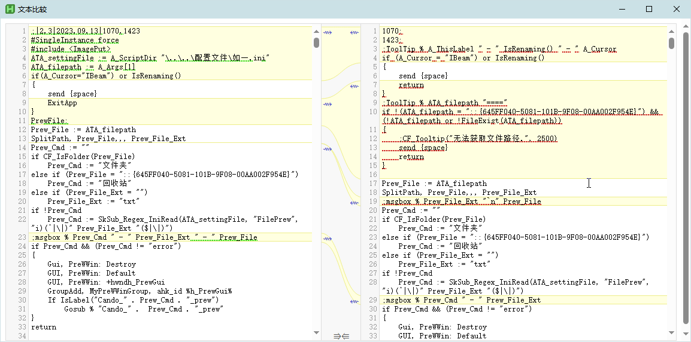

<link rel="stylesheet" href="../actions/css/atom-one-light.min.css">

[返回主页](../index.md)

#  文本比较

**动作编号**: 1350, 1351  
**动作名称**: 文本比较1 / 文本比较2  
**动作作用的对象**: 选中对象  
**动作热键**: 无  
**动作鼠标手势**: 无  
**动作说明**: 网页版的文本对比  
**动作截图**:  
    
**动作内容**: run|"%B_Autohotkey2%" "%A_ScriptDir%\外部脚本\V2\文本对比(WebView2).ahk2" "%CandySel%"  
将选中文本或文件作为参数, 执行外部脚本文件 "文本对比(WebView2).ahk2", ATA 内置了该动作  

canfunc|ExecSend|%CandySel%|文本对比 ahk_class AutoHotkey  
将选中文本或文件作为参数, 发送到已经打开的 "文本比较" 脚本, 如意内置的函数  

**代码或详细解释**:  
选中文件或文本后, 执行动作, 显示一个左右两边是编辑框(RichEdit) 的网页, 使用 Js 进行文本比较.  
动作 1350 将选中对象内容放入窗口左边的编辑框. 需配合动作 1351, 将第二次选中的内容放入窗口右边的编辑框, 也可以将文件拖入编辑框.  
