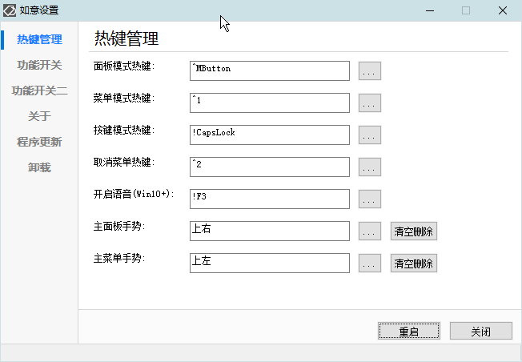
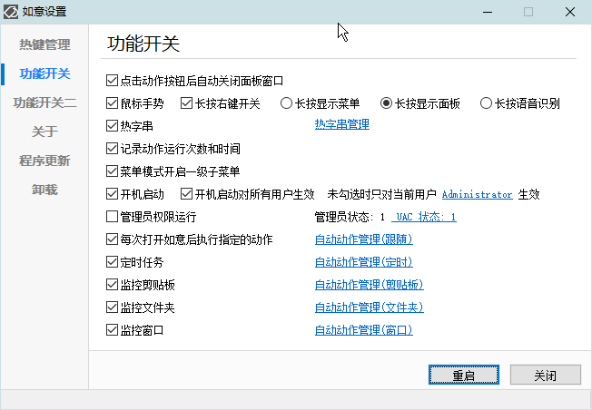
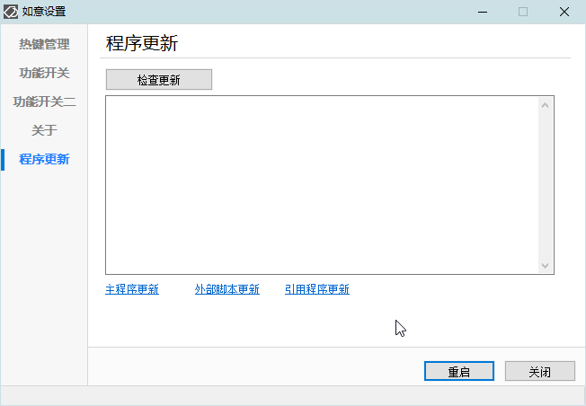

<link rel="stylesheet" href="../actions/css/atom-one-light.min.css">

[返回主页](../index.md)

#  如意百宝箱-Ahk 动作介绍

**动作编号**: 1413  
**动作名称**: 如意设置  
**动作作用的对象**: 无条件  
**动作热键**: 无  
**动作鼠标手势**:  
**动作说明**: 显示如意的设置界面  
**动作截图**:  
    
    
    
**动作内容**: Cando|TM_SettingsM  
为如意内置的动作, 执行如意的内置的标签 "TM_SettingsM"  

**代码或详细解释**:  
如意设置界面, 整合如意的各种设置.  