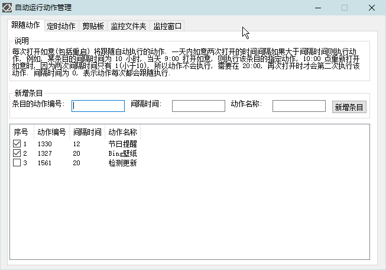
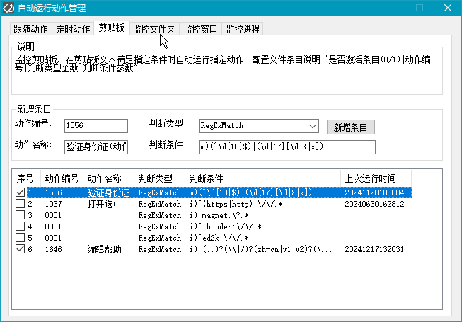
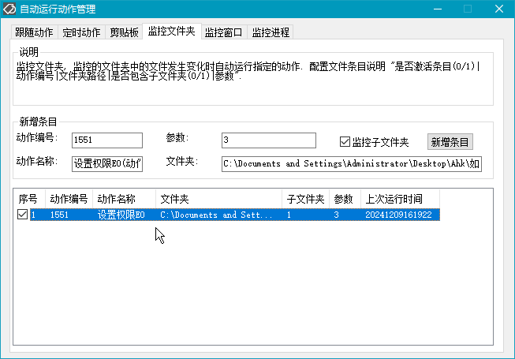
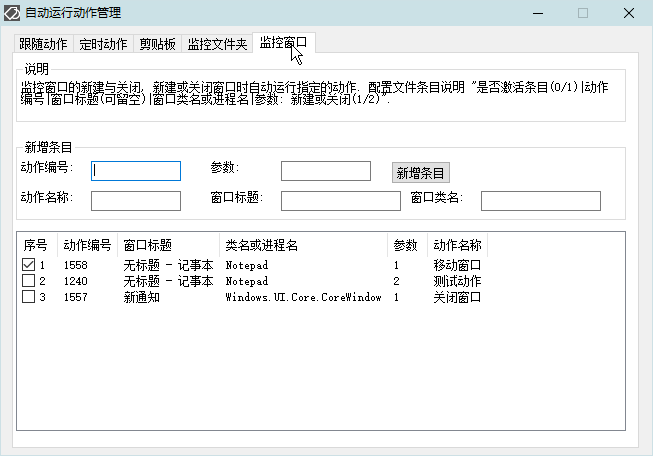
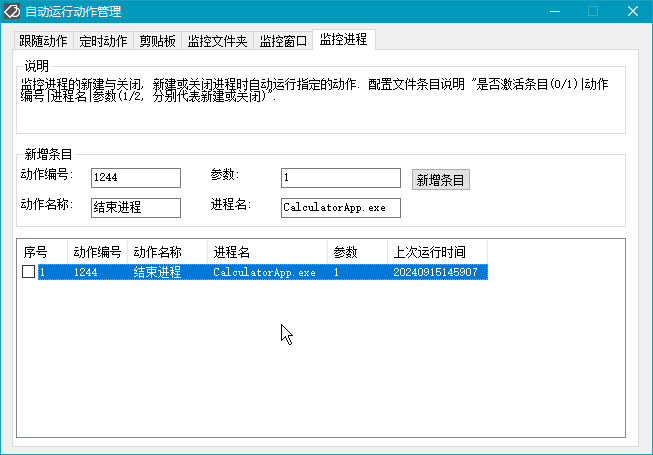

<link rel="stylesheet" href="../actions/css/atom-one-light.min.css">

[返回主页](../index.md)

#  定时管理

**动作编号**: 1414  
**动作名称**: 定时管理  
**动作作用的对象**: 无条件  
**动作热键**: 无  
**动作鼠标手势**: 无  
**动作说明**: 自动运行动作的管理界面(启动跟随, 定时动作, 监控剪贴板, 监控文件夹, 监控窗口)  
**动作截图**:  
    
    
    
    
    
    
**动作内容**: Cando|TimingActionM  
为如意内置的动作, 执行如意的内置的标签 "TimingActionM"  

**代码或详细解释**:  
显示一个设置窗口, 可以在该设置界面管理如意自动运行的动作.  

**更新历史**:  
1. 2.2 首次发布自动动作管理界面  
1. 2.5 新增 监控剪贴板, 监控文件夹变化, 监控窗口 功能  
2. 2.7 自动运行动作管理界面使用统一的逻辑和管理界面, 旧版配置不再适用  
3. 2.8 自动运行动作管理中新增进程监控  
4. 2.9 跟随动作支持重复运行, 每隔几分钟或小时重复运行, 旧版配置不再适用  