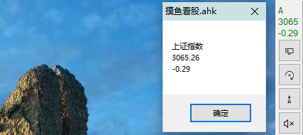

<link rel="stylesheet" href="../actions/css/atom-one-light.min.css">

[返回主页](../index.md)

#  摸鱼看股

**动作编号**: 1528  
**动作名称**: 摸鱼看股  
**动作作用的对象**: 无条件  
**动作热键**: 无  
**动作鼠标手势**: 无  
**动作说明**: 更改额外任务栏最上面文本为上证指数当天价格和涨幅  
**动作截图**:  
    
**动作内容**: run|"%B_Autohotkey%" "%A_ScriptDir%\外部脚本\工具类\摸鱼看股.ahk" "000001"  
将股票代码 "000001"(代表上证指数) 作为参数, 执行外部脚本文件 "摸鱼看股.ahk".    

**代码或详细解释**:  
在动作管理界面, 在动作内容中指定新的股票代码, 即可获指定股票当天当时的价格和涨跌.  
若额外任务栏存在则在其顶部显示, 否则显示一个对话框.  

**相关动作**:  
[1523 额外任务栏](1523.md)

**更新历史**:  
1. 2.4 中添加该动作