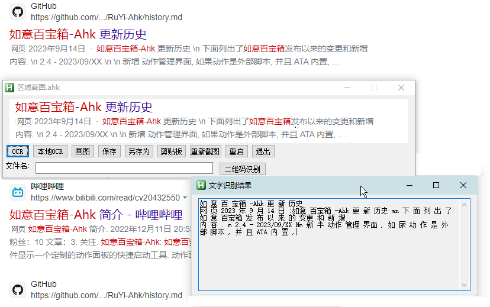

<link rel="stylesheet" href="../actions/css/atom-one-light.min.css">

[返回主页](../index.md)

#  区域截图

**动作编号**: 1530  
**动作名称**: 区域截图  
**动作作用的对象**: 无条件  
**动作热键**: 无  
**动作鼠标手势**: 无  
**动作说明**: 拖动鼠标区域截图  
**动作截图**:  
    
**动作内容**: run|"%B_Autohotkey%" "%A_ScriptDir%\外部脚本\工具类\区域截图.ahk"  
执行外部脚本文件 "区域截图.ahk"  

**代码或详细解释**:  
拖动鼠标区域截图, 截图后弹出一个窗口进行以下操作:
1. ocr 使用系统(Win10+) 自带的 OCR 识别截取的图片, 识别准确率聊胜于无  
2. 画图, 使用系统画图程序简单编辑截图  
3. 保存自动保存到 \截图目录\区域截图_%当前时间%.png, 如 区域截图_20231031212625.png  
4. 另存为  

**相关动作**:  
[1171 截取窗口](1171.md), [1172 截取屏幕](1172.md), [1360 截取屏幕](1360.md), [1503 截取窗口](1503.md), [1521 截取屏幕](1521.md)

**更新历史**:  
1. 2.4 中添加该动作  
2. 2.5 中截图展示界面添加文件名输入框和本地 OCR按钮(需将 Vis2 下载的压缩包相关文件解压到 \引用程序\其它资源\leptonica_util 和 \引用程序\其它资源\tesseract)  
3. 2.6 添加重新截图的按钮, 在不重启脚本的情况下能重新开始截图  