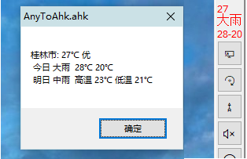

<link rel="stylesheet" href="../actions/css/atom-one-light.min.css">

[返回主页](../index.md)

#  天气

**动作编号**: 1554  
**动作名称**: 天气  
**动作作用的对象**: 无条件  
**动作热键**: 无  
**动作鼠标手势**: 无  
**动作说明**: 利用免费的天气api显示当天气温  
**动作截图**:  
    
**动作内容**: run|"%B_Autohotkey%" "%A_ScriptDir%\外部脚本\工具类\天气.ahk" "101300501"  
将地区代码 "101300501"(代表桂林) 作为参数, 执行外部脚本文件 "天气.ahk", ATA 内置该动作    

**代码或详细解释**:  
在中国天气网 http://www.weather.com.cn/ 获取城市代码, 修改动作参数, 即可获取当地天气.  
若额外任务栏存在则在其顶部显示, 否则显示一个对话框.  

**相关动作**:  
[1523 额外任务栏](1523.md)

**更新历史**:  
1. 2.5 中添加该动作