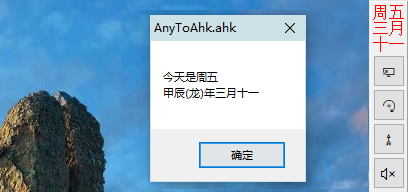

<link rel="stylesheet" href="../actions/css/atom-one-light.min.css">

[返回主页](../index.md)

#  农历时间

**动作编号**: 1555  
**动作名称**: 农历时间  
**动作作用的对象**: 无条件  
**动作热键**: 无  
**动作鼠标手势**: 无  
**动作说明**: 显示农历时间  
**动作截图**:  
    
**动作内容**: run|"%B_Autohotkey%" "%A_ScriptDir%\外部脚本\工具类\时间_显示农历.ahk"  
无参数, 执行外部脚本文件 "时间_显示农历.ahk", ATA 内置该动作    

**代码或详细解释**:  
若额外任务栏存在则在其顶部显示, 否则显示一个对话框.  

**相关动作**:  
[1523 额外任务栏](1523.md)

**更新历史**:  
1. 2.5 中添加该动作