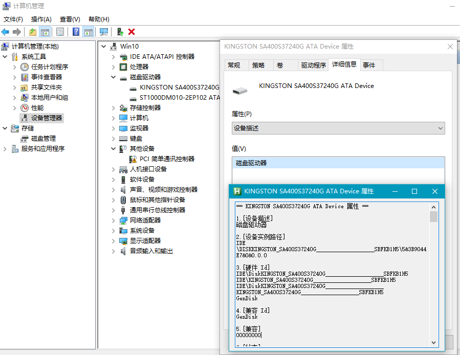

---
layout: default
title: 如意百宝箱-Ahk
description: 如意百宝箱-Ahk 动作介绍
---
<link rel="stylesheet" href="../actions/css/atom-one-light.min.css">

#  设备属性  
**动作编号**: 1695  
**动作名称**: 设备属性  
**动作作用的对象**: 特定窗口  
**动作热键**:  
**动作鼠标手势**:  
**动作说明**: 设备管理器窗口设备属性窗口详细信息标签页获取所有信息  
**动作截图**:  
    
**动作内容**: run|"%B_Autohotkey%" "%A_ScriptDir%\外部脚本\窗口处理\设备属性窗口获取详细信息.ahk"  
执行外部脚本, 获取硬件属性窗口详细信息选项卡中的所有属性的文本  

**更新历史**:  
1. 2.9 首次引入  