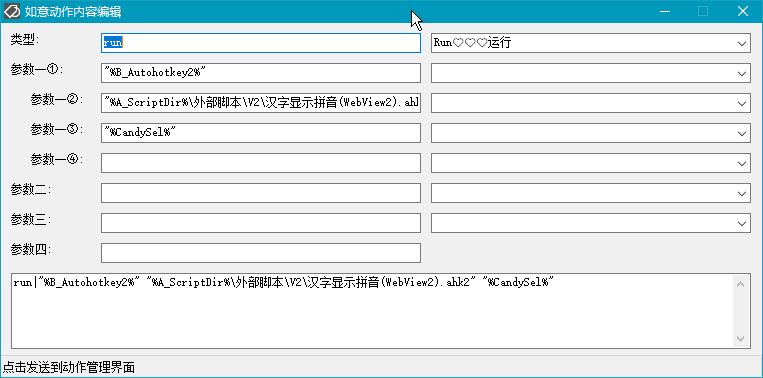

---  
layout: default  
title: 如意百宝箱-Ahk  
description: 如意百宝箱-Ahk 动作介绍  
---  
<link rel="stylesheet" href="../actions/css/atom-one-light.min.css">  
  
  
  
#  动作编辑  
**动作编号**: 1703  
**动作名称**: 动作编辑  
**动作作用的对象**: 无条件@如意  
**动作热键**:   
**动作鼠标手势**:   
**动作说明**: 动作内容编辑窗口  
**动作截图**:  
    
**动作内容**: Cando|ActionEditM  
执行如意的内置的标签 "ActionEditM", 为如意内置动作  
  
**代码或详细解释**:  
打开如意动作内容编辑窗口, 方便编辑动作执行的命令  
  
**更新历史**:  
1. 2.9 中添加该动作  
  
**相关动作**:  
[动作管理](1192.md)