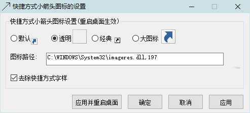

<link rel="stylesheet" href="../actions/css/atom-one-light.min.css">

[返回主页](../index.md)

#  快捷方式小箭头

**动作编号**: 1006  
**动作名称**: 快捷方式  
**动作作用的对象**: 无条件  
**动作热键**: 无  
**动作鼠标手势**: 无  
**动作说明**: 设置快捷方式的小箭头图标和快捷方式字样    
**动作截图**:  
    
**动作内容**: run|"%B_Autohotkey%" "%A_ScriptDir%\外部脚本\注册表\快捷方式箭头图标设置.ahk"  
执行外部脚本文件 "快捷方式箭头图标设置.ahk", ATA 内置动作  

**代码或详细解释**:  
通过修改注册表, 设置快捷方式的小箭头样式和是否带有 "快捷方式" 字样.  