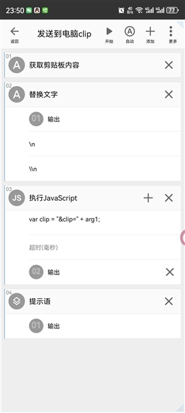
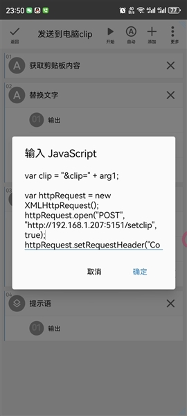
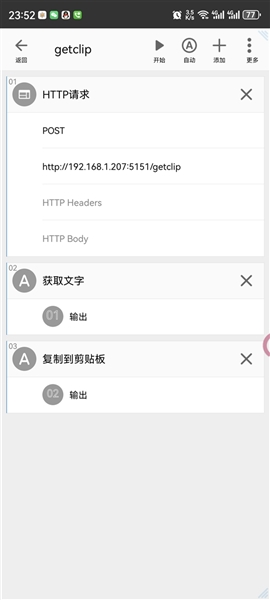

[返回主页](index.md)

# [](#header-2) 网络控制
通过网页来执行如意中的动作.  
运行如意的电脑, 如果电脑 IP 为 192.168.1.2, 电脑中的浏览器打开网址 http://127.0.0.1:5151 或 http://192.168.1.2:5151, 手机(手机与电脑处于同一局域网中) 浏览器打开网址 http://192.168.1.2:5151, 通过网页来执行如意动作.  
2. 直接打开网址 http://192.168.1.2:5151/1234 按动作编号执行动作.  

# [](#header-2) 手机与 PC 剪贴板互通
一、fooview 悬浮球自定义任务实现剪贴板互通

01. 发送剪贴板到电脑  
  
  

```Js
var clip = "&clip=" + arg1;

var httpRequest = new XMLHttpRequest();
httpRequest.open("POST", "http://192.168.1.2:5151/setclip", true);
httpRequest.setRequestHeader("Content-type","text/plain");
httpRequest.send(clip);
```

02. 获取电脑剪贴板  
  
